# Hotel Booking System API

Booking API which allows users to place, modify or cancel reservations from hotels' rooms. It also let hotel administrators get all the created reservations.

It has been developed in Java and deployed in AWS Lambda using a custom runtime powered by GraalVM. It includes unit testing with JUnit 5 and Mockito. It uses PostgreSQL as its main database and CloudFormation templates to create all the infrastructure.

## Technologies used
 &nbsp; &nbsp;
 &nbsp; &nbsp;
 &nbsp; &nbsp;
 &nbsp; &nbsp;
 &nbsp; &nbsp;
 &nbsp; &nbsp;

## Data model
Data was organized in **three tables: hotels, rooms and reservations**, which are described below.

#### Hotels
| Column name  | Data type    | Description                                                  |
| :-----       | :---         | :---                                                         |
| id     	   | UUID         |	Unique identifier                                            |
| name	       | VARCHAR(255) |	Hotel name                                                   |
| country_code | VARCHAR(2)   |	Hotel country code (based on ISO 3166-1), e.g. PE, CA, etc.  |
| city         | VARCHAR(60)  |	Hotel city                                                   |
| latitude     | float8	      | Hotel location latitude                                      |
| longitude    | float8	      | Hotel location longitude                                     |

#### Rooms
| Column name      | Data type   | Description                                                   |
| :-----           | :---        | :---                                                          |
| id     	       | UUID        |	Unique identifier                                            |
| hotel_id         | UUID        |	Foreign key to hotel identifier                              |
| type             | VARCHAR(50) |	Room type, e.g. Standard, Premium, etc.                      |
| number_of_guests | smallint    |	Amount of people which can share the room                    |
| price            | int4	     | Price                                                         |
| currency_code    | VARCHAR(3)	 | Price's currency code (based on ISO 4217), e.g. PEN, CAD etc. |

#### Reservations
| Column name   | Data type | Description                           |
| :-----        | :---      | :---                                  |
| id	        | UUID	    | Unique identifier                     |
| room_id	    | UUID	    | Foreign key to room identifier        |
| checkin_date	| date	    | Date on which the accomodation begins |
| checkout_date	| date	    | Date on which the accomodation ends   |
| guest_id	    | UUID	    | Cognito's guest identifier            |

The relationship between these tables can be seen in the following Entity-Relationship diagram:
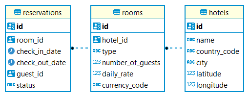

## Architecture

The architectured solution consists of a collection of serverless functions (AWS Lambda) with native authentication handling (Amazon Cognito), native API handling (Amazon API Gateway) and a relational database (Amazon RDS) with credentials stored in a secured way (AWS Secrets Manager). Deployment must be done in **multiple availability zones** to ensure **high availability**.

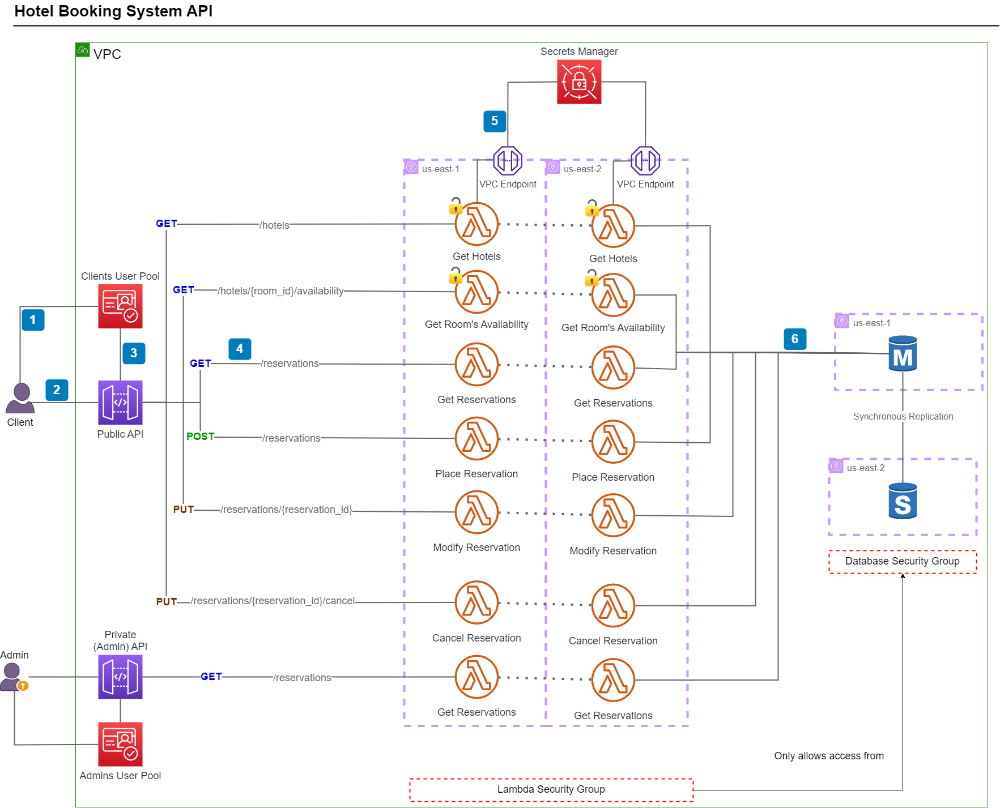

| Id    | Description
| :---:  | :---
| 1     | User sends his/her credentials to Cognito (using Hosted UI) to retrieve a JWT
| 2     | The credentials are sent together with the request to API Gateway
| 3     | API Gateway validates the credentials against Cognito and if valid, authorizes the request 
| 4     | API Gateway sends the payload to Lambda function including the user identifier from Cognito
| 5     | Lambda function retrieves the database credentials from Secrets Manager
| 6     | Lambda function connects to database using the retrieved credentials and performs the operation requested

Important considerations:
* Lambda functions and Database are deployed in private subnets from a VPC. Therefore, to have access to an external service such as Secrets Manager, a VPC endpoint per availability zone must be added.

* "Get Hotels" and "Get Room's Availability" functions do not require user login, i.e. API Gateway does not validate the JWT against Cognito. Clients should be able to know a room's availability without having to create an account to place a reservation.

* The administrator workflow is similar to the client user's one. The only difference is that it validates the JWT against a different User Pool from Cognito (which only has credentials from the hotel administrators).

* All information is retrieved from / saved to a Master database. This database is replicated synchronously with a Standby database. In the event of an availability problem with the first availability zone, connections are pointed to the Standby database.

* Lambda functions scale on demand, so multiple simultaneous requests can be served without the need for any special scalability configuration.

## Development
Two microservices (Hotels and Reservations) were developed to ensure the creation of the handlers to support the seven endpoints described in the architecture. In order to avoid code duplication, a "commons" package was generated and used as a dependency for both microservices.

| Microservice | Handler                     | Method + Endpoint                             | Description                                                                               |
| :-----       | :---                        | :---                                          | :---                                                                                      |
| hotels	   | GetHotelsHandler	         | GET /hotels                                   | Retrieves all hotels with rooms information                                               |
| hotels	   | GetHotelAvailabilityHandler | GET /hotels/{room_id}/availability            | Retrieves the availability for a specific room                                            |
| reservations | GetReservationsHandler	     | GET /reservations _(For both user and admin)_ | Retrieves the reservations created (for a user or for all users if triggered by an admin) |
| reservations | PlaceReservationHandler	 | POST /reservations                            | Creates a new reservation                                                                 |
| reservations | ModifyReservationHandler	 | PUT /reservations/{reservation_id}            | Updates the check-in and/or check-out dates for an existing reservations                  |
| reservations | CancelReservationHandler	 | PUT /reservations/{reservation_id}/cancel     | Cancel a valid reservation                                                                |

### Exceptions Handling
The developed solution has 11 types of exceptions in case the system isn't able to interact with the resources or if the user enters invalid values.

| Code | Name (Type)                                                                  | Description                                                                                    |
| :--- | :---                                                                         | :---                                                                                           |
| 001  | DatabaseConnectionException                                                  | App wasn't able to connect to the database                                                     |               
| 002  | DatabaseAccessException                                                      | SQL query didn't execute successfully                                                          | 
| 003  | JsonParsingException	                                                      | A String JSON couldn't be parsed                                                               | 
| 004  | UUIDParsingException	                                                      | A String object couldn't be converted to a UUID                                                |
| 005  | ReservationNotFoundException	                                              | Reservation to be modified/cancelled doesn't exist or doesn't belong to user                   |
| 006  | InvalidReservationDatesException (Past check-in)                             | Check-in must start at least the next day of booking                                           |
| 007  | InvalidReservationDatesException (Check-in greater than Check-out)           | Check-out must be equal or later than Check-in                                                 |
| 008  | InvalidReservationDatesException (Stay too long)                             | Maximum stay is 3 days                                                                         |
| 009  | InvalidReservationDatesException (Unavailable dates)                         | Selected dates are unavailable (already chosen by other guests or later than 30 days from now) |
| 010  | InvalidReservationDatesException (Creating reservation extends previous one) | By creating this new reservation, you are extending a previously created reservation           |
| 011  | InvalidReservationDatesException (Modifying reservation merges previous one) | By modifying this reservation, you are merging a previously created reservation with this one  |

These exception are returned to user when trying to call the API. Some examples are presented below.

* If a user tries to create a reservation for today's date:
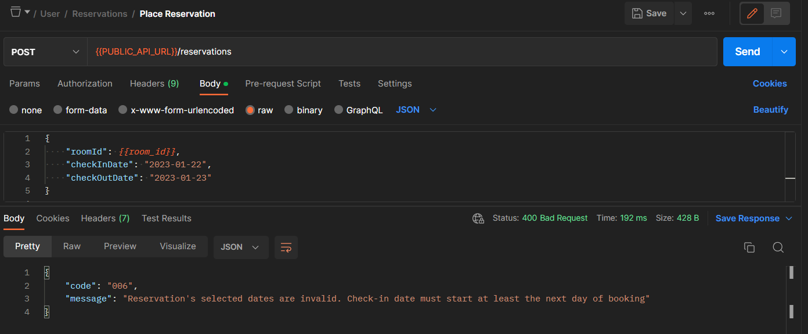

* If a user tries to stay more than 3 days:
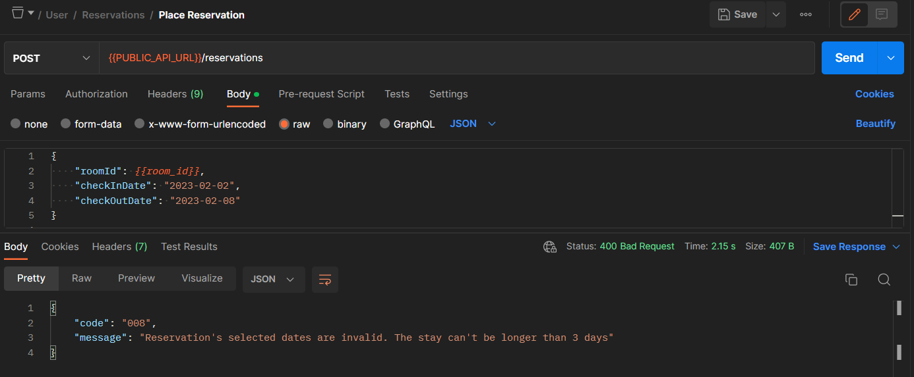

However, if the payload meets all the validity requirements, the requested operation will be carried out: 
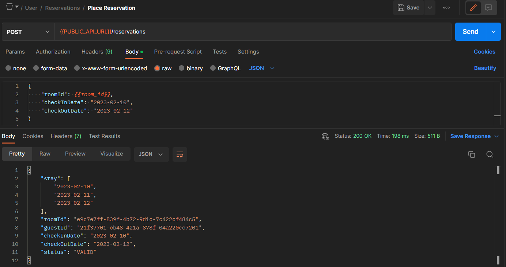

### Unit Tests
The units tests were created using **JUnit 5** (for the creation of the tests and validation of results) and **Mockito** (for the creation of objects which can return test values) frameworks.

The **ReservationValidationService** class (belonging to the _Reservations_ microservice) was identified as the service with the **more business logic content**, so unit tests of all the methods (and all lines) of this class were performed.
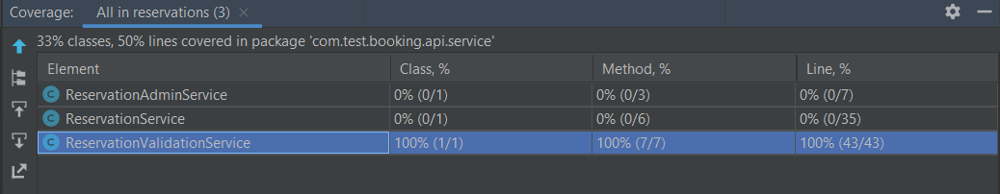

### Build
The **GraalVM Native Image** build technology was used to generate a **native executable**. The main goal of choosing this technology was to deal with the cold start problem that Lambda functions have when using compiled languages like Java.

The results were extremely good, obtaining **less than 2 seconds of cold start** in all the scenarios.

A very important point to take into account when compiling with GraalVM Native Image is that the resulting binary file is platform dependent (Linux, Windows, MacOS). And since the Lambda functions run with a custom Amazon Linux 2 runtime, the compilation and build of the executable must be done on a Linux machine.

A way of achieving this is by running a container from any Linux distribution, including Amazon Linux 2 itself, e.g. **docker run --rm -it -v %cd%:/usr/booking-system amazonlinux:2**.

The result of this ahead-of-time compilation is a zip file with executables to run in the AWS Lambda container. The **boostrap** file is mandatory because the Amazon Linux 2 container looks for this file when bootstrapping a Lambda container.
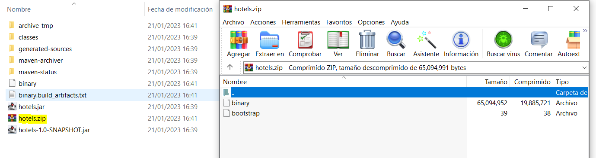

## Infrastructure
The deployment of all components was done using CloudFormation templates and _cfn-cli_ tool (https://github.com/Kotaimen/awscfncli)

The components were divided into different folders as described below.

| Folder           | AWS Service(s)       |  Description                                                           |
| :-----           | :---                 | :---                                                                   |
| api-gateway	   | API Gateway	      | Creates the public and private (admin) API with its resources          |
| cognito	       | Cognito              | Creates the public and private user pools to issue access credentials  |
| database         | RDS, Secrets Manager | Creates the database and a secret holding its credentials              |
| lambda-functions | Lambda, API Gateway  | Creates the Lambda functions with its role and API method              |
| network          | EC2	              | Creates the VPC, Subnets, Security Groups and VPC Endpoints            |

For economic reasons, the solution was deployed in a single availability zone. However, to turn it into a high availability architecture (as the architecture diagram), only a few changes must be made:
* In the **VPC** template, the **EndpointSecretsManagerPrivateSubnetB** resource must be uncommented
* In the **Lambda-Function** template, the **VpcConfig** of the **LambdaMicroserviceFunction** resource must uncomment the **SubnetB** from the **SubnetIds** attribute. 
* In the **Database** template, the parameter **DBMultiAZ** must be as true.

## Instructions for testing the live version
A version of this API is currently running on AWS in a single AZ mode (as described in the infrastructure section).

To test it, please download the Postman's collection and environment located in the **postman** folder and import it to your local Postman app.

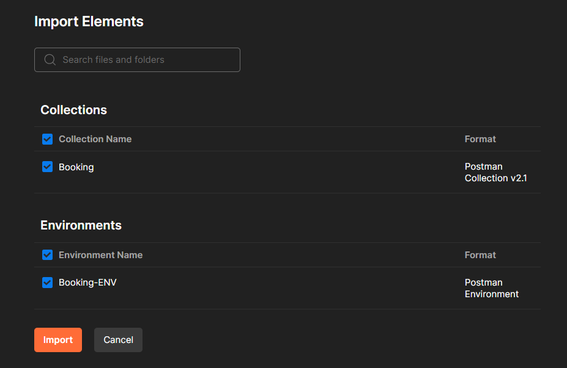

After importing the collection, you should be ready to test any of the seven endpoints.

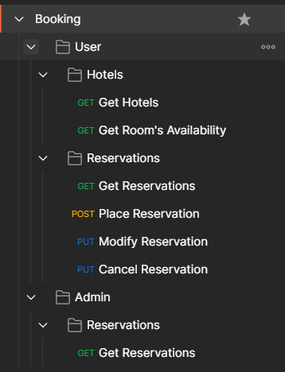

Just make sure:
1. You are pointing to the correct environment (Upper right section)
2. You have logged in as a user / or admin (only for the reservations endpoints)

To log in, just open the **User** or **Admin** folder and click on the **Get New Access Token** button. It will open the Cognito Hosted UI.

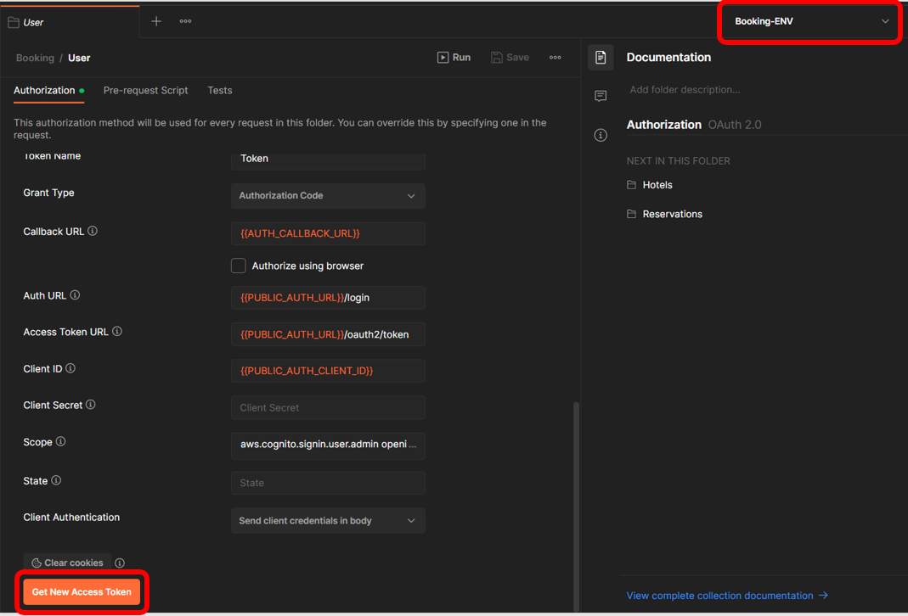

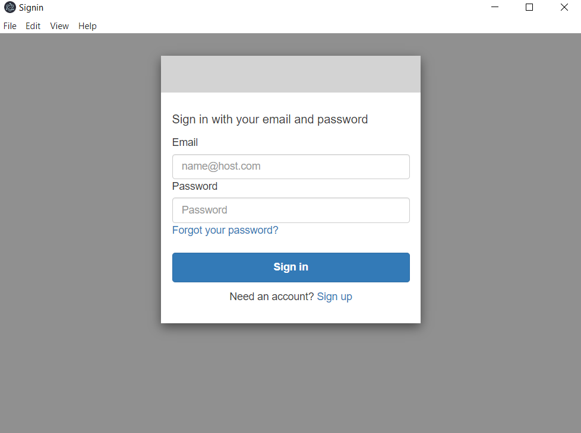

Please use the following credentials to sign-in:

| Type  | Email           |  Password     |
| :---- | :---            | :---          |
| User	| mock@client.com | j2zWD&*55jv3  |
| Admin	| admin@hotel.com | 4Hkv#s4g583h  |
